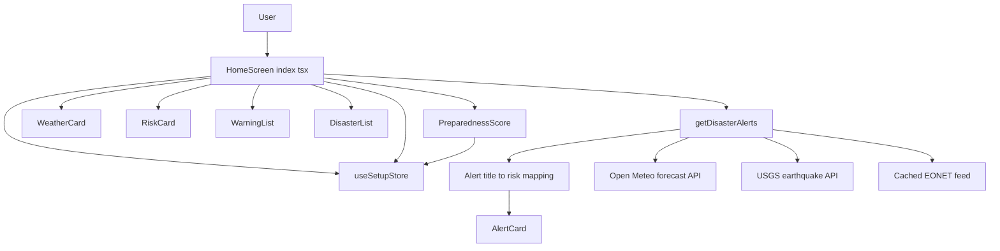
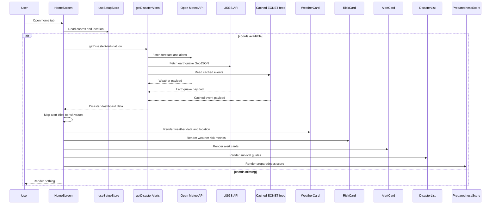
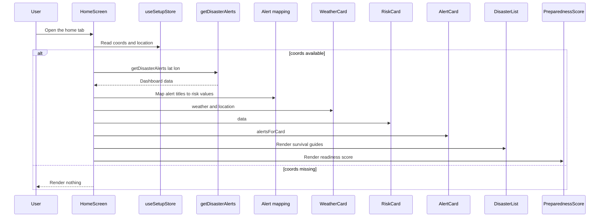
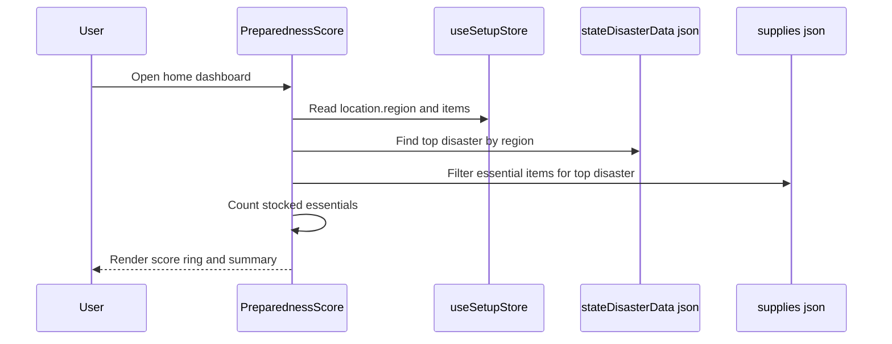

# Emergency and Inventory Management Domain

## Overview

This dashboard section is the app’s landing experience for disaster awareness. It combines live alert synthesis, weather conditions, regional location context, survival guidance, and a preparedness score into one scrollable home screen.

The screen logic in  is intentionally thin: it reads persisted setup state from `useSetupStore`, fetches live disaster data through `getDisasterAlerts`, converts returned alert titles into card-ready risk values, and then hands display concerns to reusable widgets such as `WeatherCard`, `RiskCard`, `AlertCard`, `DisasterList`, `WarningList`, and `PreparednessScore`. The result is a clear composition boundary: the screen coordinates data, while the components render presentation.

## Architecture Overview



## Home Dashboard Orchestration

### Home Screen

The home dashboard is driven by coords and location from useSetupStore. Until coordinates exist and getDisasterAlerts resolves, the screen returns null and renders nothing.

*`disaster-app/app/(tabs)/index.tsx`*

The `HomeScreen` function is the composition root for this section. It reads `coords` and `location` from `useSetupStore`, triggers live data loading in a `useEffect`, and renders the dashboard only after data has arrived.

#### Responsibilities

- Reads persisted location context from `useSetupStore`.
- Calls `getDisasterAlerts(coords.lat, coords.lon)` when coordinates are available.
- Derives alert card entries from `data.alerts` and `data.risk`.
- Renders the dashboard widgets in a fixed vertical order.
- Surfaces the current district and city above the weather card.

#### Local State and Derived Values

| Name | Type | Purpose |
| --- | --- | --- |
| `data` | `any` | Holds the resolved object returned by `getDisasterAlerts`. |
| `alertsForCard` | `{ title: string; riskLevel: number }[]` | Derived from `data.alerts` and mapped to component-specific risk values. |
| `TEST_DISASTER` | `null` | Test override slot; currently inactive. |


#### Data-to-UI Mapping

| Incoming alert title | Risk source |
| --- | --- |
| `Flood Risk` | `data.risk.flood` |
| `Storm Risk` | `data.risk.storm` |
| `Heatwave Risk` | `data.risk.heat` |
| `Earthquake Risk` | `data.risk.earthquake` |
| Any other title | `0` |


#### Render Order

1. Location header using `location?.district` and `location?.city`
2. `WeatherCard` with `data.weather` and `location`
3. `RiskCard` with full `data`
4. `AlertCard` with `alertsForCard`
5. `DisasterList`
6. `PreparednessScore`

### Home Screen Data Fetch Flow



## Presentation Widgets

### Weather Card

TEST_DISASTER is hard-coded to null, so the override branch that assigns fixed risk values never runs. [!NOTE] getDisasterAlerts already catches its own failures and returns a fallback payload, so the HomeScreen .catch(console.error) path only applies if the helper rejects unexpectedly.

*`disaster-app/components/WeatherCard.tsx`*

`WeatherCard` renders the live weather summary that the home screen receives from `getDisasterAlerts`. It is driven by localized labels from `useLanguageStore` and uses the location district to anchor the current reading to a place.

#### Props

| Property | Type | Description |
| --- | --- | --- |
| `weather` | `any` | Weather object containing `temp`, `wind`, `humidity`, and `weatherType`. |
| `location` | `any` | Location object used to display the district. |


#### Public Methods

| Method | Description |
| --- | --- |
| `getWeatherIcon` | Maps `weatherType` strings to `Ionicons` glyph names. |


#### Weather Icon Mapping

| Weather type input | Icon |
| --- | --- |
| Contains `clear` or equals `sunny` | `sunny` |
| Contains `partly cloudy` | `cloudy` |
| Contains `cloud` | `cloud` |
| Contains `fog` | `cloudy-night` |
| Contains `drizzle` | `rainy` |
| Contains `rain` | `rainy` |
| Contains `snow` | `snow` |
| Contains `freezing` | `ice-cream` |
| Contains `thunderstorm` | `thunderstorm` |
| Contains `wind` | `wind` |
| Contains `hot` | `thermometer` |
| Anything else | `partly-sunny` |


#### Rendered Content

- Current temperature in degrees Celsius.
- Wind and humidity line with localized labels.
- Location district.
- Weather icon derived from `weather.weatherType`.

### Risk Card

*`disaster-app/components/Riskcard.tsx`*

`RiskCard` is a compact weather metrics strip. Despite the filename, the component does not render disaster risk percentages; it renders weather conditions from `data.weather`.

#### Props

| Property | Type | Description |
| --- | --- | --- |
| `data` | `any` | Full dashboard object returned by `getDisasterAlerts`. |
| `data.weather` | object | Weather payload containing humidity, wind, and rain. |


#### Public Methods

| Method | Description |
| --- | --- |
| `RiskCard` | Renders the weather metric row from `data.weather`. |


#### Rendered Metrics

| Metric | Source field | Display format |
| --- | --- | --- |
| Humidity | `weather.humidity` | Percentage |
| Wind | `weather.wind` | `km/h` |
| Rain | `weather.rain` | `mm`, or `—` when undefined |


### Alert Card

*`disaster-app/components/AlertCard.tsx`*

`AlertCard` turns normalized alert entries into visual severity cards. It localizes the empty state and severity badges through `useLanguageStore`.

#### Props

| Property | Type | Description |
| --- | --- | --- |
| `alerts` | `AlertItem[]` | Array of alert entries with title and computed risk level. |


#### Public Methods

| Method | Description |
| --- | --- |
| `getRiskBackground` | Chooses a background color based on `riskLevel`. |
| `getAlertIcon` | Maps an alert title to an icon name and icon color. |
| `AlertCard` | Renders alert cards or the empty state. |


#### `AlertItem` Interface

| Property | Type | Description |
| --- | --- | --- |
| `title` | `string` | Alert title such as `Flood Risk`. |
| `riskLevel` | `number` | Normalized risk percentage passed to the card. |


#### Risk Styling Rules

| Risk level | Background color | Badge label |
| --- | --- | --- |
| `>= 80` | `#FFEBEE` | `HIGH` |
| `>= 60` | `#FFF3E0` | `HIGH` |
| `>= 40` | `#FFFDE7` | `MEDIUM` |
| `< 40` | `#E8F5E9` | `LOW` |


#### Alert Icon Mapping

| Title | Icon | Color |
| --- | --- | --- |
| `Flood Risk` | `water` | `#1E88E5` |
| `Storm Risk` | `thunderstorm` | `#5E35B1` |
| `Heatwave Risk` | `sunny` | `#F39C12` |
| `Earthquake Risk` | `pulse` | `#E53935` |
| Anything else | `alert-circle` | `#757575` |


#### Empty State

When `alerts` is empty or missing, the card shows:

- a green `checkmark-circle` icon
- the localized `noActiveAlerts` message

### Warning List

*`disaster-app/components/WarningList.tsx`*

`WarningList` is a reusable early-warning strip built directly from a `risk` object. It presents the risk values as horizontal cards and labels them as either high risk or low risk.

#### Props

| Property | Type | Description |
| --- | --- | --- |
| `risk` | `any` | Risk object with `flood`, `storm`, `heat`, and `earthquake` fields. |


#### Public Methods

| Method | Description |
| --- | --- |
| `WarningList` | Renders the horizontal early warning cards. |


#### Risk Cards

| Title | Value source |
| --- | --- |
| Flood | `risk.flood` |
| Storm | `risk.storm` |
| Heat | `risk.heat` |
| Earthquake | `risk.earthquake` |


#### Severity Label Rule

| Value | Label |
| --- | --- |
| `> 60` | `High Risk` |
| `<= 60` | `Low` |


### Disaster List

*`disaster-app/components/DisasterList.tsx`*

`DisasterList` exposes survival guides as tappable icons. It sorts disaster types by regional score, opens a modal for the selected disaster, and renders localized survival steps.

#### Public Methods

| Method | Description |
| --- | --- |
| `getIconName` | Maps a disaster type to a `FontAwesome6` icon name. |
| `getDisasterScore` | Computes `freq * sev` for a disaster and region. |
| `DisasterList` | Renders the guide launcher row and the survival modal. |


#### Disaster Types in `SURVIVAL_GUIDE`

| Type | stepsKey |
| --- | --- |
| Flood | `flood` |
| Earthquake | `earthquake` |
| Storm | `storm` |
| Heat Wave | `heatWave` |
| Landslide | `landslide` |


#### Icon Mapping

| Disaster type | Icon |
| --- | --- |
| Flood | `water` |
| Earthquake | `earth-asia` |
| Storm | `cloud-rain` |
| Heat Wave | `sun` |
| Landslide | `mountain` |
| Anything else | `triangle-exclamation` |


#### Interaction Model

- The list is horizontal and uses `FlatList`.
- Tapping an icon stores the selected disaster in local state.
- The modal reads localized steps from `stepsData` using the active language and the disaster’s `stepsKey`.
- The modal closes via the header close icon, the footer button, or `onRequestClose`.

### Preparedness Score

*`disaster-app/components/PreparednessScore.tsx`*

`PreparednessScore` turns location-aware inventory readiness into a visual percentage ring. It computes the top regional disaster, finds the essential supplies for that disaster, and compares them against stocked inventory items from `useSetupStore`.

#### Public Methods

| Method | Description |
| --- | --- |
| `getTopDisaster` | Returns the highest scoring disaster for a region. |
| `getEssentialItemsForDisaster` | Filters supplies where disaster priority is above `0.7`. |
| `PreparednessScore` | Renders the score ring, text summary, and stocked essentials count. |


#### Data Sources

| Source | Purpose |
| --- | --- |
| `Disaster` from  | Used to determine the top disaster for the current region. |
| `supplies` from  | Used to find essential items for the selected disaster. |
| `useSetupStore` | Provides `location` and `items`. |
| `useLanguageStore` | Localizes labels and count text. |


#### Score Calculation

| Step | Expression |  |
| --- | --- | --- |
| Determine top disaster | Highest `(freq * sev)` for `location.region` |  |
| Select essentials | `supplies.filter((item) => (item.priority?.[disasterType] | 0) > 0.7)` |
| Count stocked essentials | Compare stocked item names from `items` against `item.item` values in supplies |  |
| Compute score | `(stockedEssentialCount / totalEssential) * 100` |  |


#### Color Thresholds

| Score | Color |
| --- | --- |
| `< 50` | `#EF4444` |
| `< 75` | `#F59E0B` |
| `>= 75` | `#10B981` |


#### UI Output

- Circular SVG progress ring.
- Percentage text centered inside the ring.
- Title localized as `Preparedness Score`.
- Subtitle formatted as `for {{disaster}} in {{region}}`.
- Stocked essentials summary such as `3 / 8 essentials stocked`.

## Data Integration

### Disaster Alerts Utility

*`disaster-app/utils/Data.ts`*

`getDisasterAlerts` is the dashboard data builder. It fetches weather, earthquake, and cached event data in parallel, converts them into a single summary object, and returns fallback data if parsing or network work fails.

#### Public Methods

| Method | Description |
| --- | --- |
| `getDisasterAlerts` | Builds the home dashboard payload for a latitude and longitude. |


#### Runtime Output Shape

| Property | Type | Description |
| --- | --- | --- |
| `location` | object | Coordinates used for the fetch request. |
| `location.lat` | `number` | Latitude passed into the data sources. |
| `location.lon` | `number` | Longitude passed into the data sources. |
| `weather` | object | Derived weather summary. |
| `weather.temp` | `number` | Rounded temperature. |
| `weather.wind` | `number` | Wind speed from the current forecast. |
| `weather.rain` | `number` | Current precipitation. |
| `weather.rainProb` | `number` | Current precipitation probability. |
| `weather.humidity` | `number` | Relative humidity. |
| `weather.weatherType` | `string` | Normalized weather label. |
| `alerts` | `string[]` | Alert titles such as `Flood Risk` or official weather event names. |
| `risk` | object | Computed disaster risk summary. |
| `risk.flood` | `number` | Flood risk percentage. |
| `risk.storm` | `number` | Storm risk percentage. |
| `risk.heat` | `number` | Heat risk percentage. |
| `risk.earthquake` | `number` | Earthquake risk percentage. |


#### Error Handling Behavior

- Runs weather, earthquake, and cached event reads with `Promise.allSettled`.
- Parses each source inside its own `try/catch`.
- On failure, returns a fallback object with:- `temp: 20`
- `wind: 0`
- `rain: 0`
- `rainProb: 0`
- `humidity: 50`
- `weatherType: 'Unknown'`
- empty risk scores
- `alerts: ['Unable to fetch disaster data']`

#### Alert Synthesis Rules

- Flood alerts are only added when `floodRisk >= 70` and the NASA flood source is present.
- Storm alerts are only added when `stormRisk >= 70` and the NASA storm source is present.
- Heat alerts are added when `heatRisk >= 70`.
- Earthquake alerts are added when `earthquakeRisk >= 50`.
- Official weather alerts are appended if they are not already present.

## API Integration

### Open Meteo Forecast and Alerts

#### Get Current Forecast and Alerts

```api
{
    "title": "Get Current Forecast and Alerts",
    "description": "Fetches current weather metrics and official alerts for the dashboard location",
    "method": "GET",
    "baseUrl": "https://api.open-meteo.com",
    "endpoint": "/v1/forecast",
    "headers": [],
    "queryParams": [
        {
            "key": "latitude",
            "value": "<lat>",
            "required": true
        },
        {
            "key": "longitude",
            "value": "<lon>",
            "required": true
        },
        {
            "key": "current",
            "value": "temperature_2m,wind_speed_10m,precipitation,precipitation_probability,relative_humidity_2m,weathercode",
            "required": true
        },
        {
            "key": "alerts",
            "value": "true",
            "required": true
        }
    ],
    "pathParams": [],
    "bodyType": "none",
    "requestBody": "",
    "formData": [],
    "rawBody": "",
    "responses": {
        "200": {
            "description": "Success",
            "body": "{\n    \"current\": {\n        \"temperature_2m\": 31.4,\n        \"wind_speed_10m\": 18.2,\n        \"precipitation\": 2.1,\n        \"precipitation_probability\": 64,\n        \"relative_humidity_2m\": 78,\n        \"weathercode\": 61\n    },\n    \"alerts\": [\n        {\n            \"event\": \"Flood Watch\"\n        }\n    ]\n}"
        }
    }
}
```

### USGS Earthquake GeoJSON Query

#### Get Recent Earthquakes Near Location

```api
{
    "title": "Get Recent Earthquakes Near Location",
    "description": "Fetches nearby earthquake events used to calculate earthquake risk",
    "method": "GET",
    "baseUrl": "https://earthquake.usgs.gov",
    "endpoint": "/fdsnws/event/1/query",
    "headers": [],
    "queryParams": [
        {
            "key": "format",
            "value": "geojson",
            "required": true
        },
        {
            "key": "latitude",
            "value": "<lat>",
            "required": true
        },
        {
            "key": "longitude",
            "value": "<lon>",
            "required": true
        },
        {
            "key": "maxradiuskm",
            "value": "500",
            "required": true
        },
        {
            "key": "limit",
            "value": "5",
            "required": true
        }
    ],
    "pathParams": [],
    "bodyType": "none",
    "requestBody": "",
    "formData": [],
    "rawBody": "",
    "responses": {
        "200": {
            "description": "Success",
            "body": "{\n    \"features\": [\n        {\n            \"properties\": {\n                \"mag\": 5.4\n            }\n        }\n    ]\n}"
        }
    }
}
```

## Feature Flows

### Dashboard Hydration and Alert Rendering



### Preparedness Score Recalculation



## State Management

### Persisted Setup State

The dashboard composes multiple values from `useSetupStore`:

- `coords` drives live data fetching.
- `location` drives the location header, `WeatherCard`, `DisasterList`, and `PreparednessScore`.
- `items` drives preparedness calculations.

### Persisted Language State

`useLanguageStore` is used by:

- `WeatherCard`
- `AlertCard`
- `DisasterList`
- `PreparednessScore`

This keeps labels and empty-state text aligned with the active language across the dashboard widgets.

### UI States

| Component | State | Behavior |
| --- | --- | --- |
| `HomeScreen` | No coordinates | Skips fetch and returns `null`. |
| `HomeScreen` | Data loading | Waits for `getDisasterAlerts` to resolve. |
| `AlertCard` | Empty alerts | Shows the green checkmark empty state. |
| `PreparednessScore` | No essentials | Renders a `0%` score. |
| `DisasterList` | Modal closed | Shows compact disaster icons only. |
| `DisasterList` | Modal open | Shows localized survival steps for the selected disaster. |


## Error Handling

`getDisasterAlerts` is the primary fault boundary for the dashboard. Its implementation handles partial failures by settling each upstream request independently, parsing each response behind its own guard, and returning a fallback object instead of throwing.

The dashboard widgets also tolerate missing data:

- `WeatherCard` uses a fallback weather label of `Partly Cloudy` when `weatherType` is missing.
- `AlertCard` renders a no-alert state for empty input.
- `RiskCard` displays `—` for missing rain values.
- `PreparednessScore` returns `0` when there are no essential items for the region.
- `DisasterList` and `PreparednessScore` both default top-disaster logic to `Flood` when no stronger match is found.

## Dependencies

### Internal Modules

- `useSetupStore` from `utils/setup`
- `useLanguageStore` from `utils/languageStore`
- `getDisasterAlerts` from `utils/Data`
- `stateDisasterData.json`
- `supplies.json`

### External Packages

- `react`
- `react-native`
- `expo-status-bar`
- `@expo/vector-icons`
- `react-native-svg`
- `zustand`

### API Providers

- Open Meteo
- USGS Earthquake GeoJSON
- Cached EONET event feed through the dashboard utility

## Testing Considerations

- Verify that `coords` from `useSetupStore` trigger `getDisasterAlerts` once and only when available.
- Verify that each returned alert title maps to the intended `riskLevel`.
- Verify that `AlertCard` renders the empty state when `alerts` is empty.
- Verify that `PreparednessScore` changes when `items` or `location.region` changes.
- Verify that `DisasterList` opens and closes its modal correctly for each disaster type.
- Verify that localized labels render correctly for both `en` and `ja`.
- Verify that `WeatherCard` uses the location district and weather type icon mapping correctly.
- Verify that the fallback payload from `getDisasterAlerts` still produces a stable dashboard shape.

## Key Classes Reference

| Class | Responsibility |
| --- | --- |
| `index.tsx` | Orchestrates home dashboard data loading and widget composition. |
| `WeatherCard.tsx` | Renders live weather, temperature, and location context. |
| `Riskcard.tsx` | Renders humidity, wind, and rain metrics from dashboard weather data. |
| `AlertCard.tsx` | Renders normalized disaster alert cards with severity badges. |
| `WarningList.tsx` | Renders a compact horizontal risk summary from the risk object. |
| `DisasterList.tsx` | Shows survival guides and localized disaster steps in a modal. |
| `PreparednessScore.tsx` | Calculates and displays preparedness coverage for the top regional disaster. |
| `Data.ts` | Fetches and synthesizes live disaster dashboard data. |
